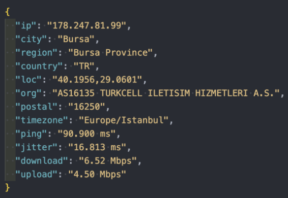

# speednetcli - A Professional CLI for Internet Speed Testing

## Overview

**speednetcli** is a high-performance command-line interface (CLI) tool designed to measure and analyze internet speed. It provides precise insights into your network connection, including download/upload speeds, latency (ping), jitter, and detailed network provider information.

## Features

- 🚀 **Speed Test**: Measure your internet's download and upload speeds.
- ⏳ **Ping Test**: Evaluate network latency with accurate round-trip time measurements.
- 🎯 **Jitter Test**: Analyze variations in ping times for stability assessment.
- 🌐 **Network Information**: Retrieve detailed ISP and location-based network insights.

## Installation

Ensure you have **Node.js** and **npm** installed. Then, install speednetcli globally:

```bash
npm install -g speednetcli
```

## Usage

Simply execute the following command in your terminal to run a complete speed test:

```bash
speednetcli
```


### Available Options

```text
-d, --download   Measure download speed
-u, --upload     Measure upload speed
-p, --ping       Measure ping (latency)
-j, --jitter     Measure jitter
-net, --net      Retrieve network provider information
--help           Display all available options
```

### Example Commands & Outputs

#### Run a Ping Test

```bash
speednetcli -p
```

_Output:_

```bash
⢀⠀ Ping      : 86.27 ms
▰▰▰▰▰▰▰ SPEEDTEST COMPLETED ▰▰▰▰▰▰▰
```

#### Check Upload Speed

```bash
speednetcli -u
```

_Output:_

```bash
⢈⠩ Upload    : 4.00 Mbps
▰▰▰▰▰▰▰ SPEEDTEST COMPLETED ▰▰▰▰▰▰▰
```

#### Retrieve Network Information

```bash
speednetcli -net
```

_Output:_

```bash
⢀⠀ Timezone  : Europe/Istanbul
⢀⠀ Provider  : AS16135 TURKCELL ILETISIM HIZMETLERI A.S.
⢀⠀ IP        : 178.247.81.99
⢀⠀ City      : Bursa
⢀⠀ Region    : Bursa Province
⢀⠀ Postal    : 16250
⢀⠀ Location  : 40.1956,29.0601
⢀⠀ Country   : TR
⢀⠀ Timestamp : 2024-04-19T18:18:49.509Z
```

## Programmatic Usage

You can also integrate speednetcli as a package in your JavaScript/Node.js projects:

```javascript
import speednetcli from 'speednetcli';

speednetcli()
  .then((info) => console.log(info))
  .catch((error) => console.error('Error:', error));
```



The above JSON response includes network information and speed test results.

## Contributing

Contributions are welcome! Feel free to open an issue or submit a pull request on GitHub.

## License

This project is licensed under the **MIT License**.