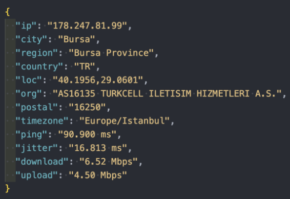

# CheckSpeed CLI Package

CheckSpeed is a command-line interface (CLI) tool for checking internet speed and retrieving network information. It provides detailed insights into various aspects of your network connection, including download and upload speeds, latency (ping), jitter, and network provider details.

## Installation

To install CheckSpeed, you need to have Node.js and npm (Node Package Manager) installed on your system. Then, simply run the following command:

```bash
npm install -g checkspeed
```

## Usage
Once installed, you can use checkspeed from the command line. Here's an example of the output you can expect:

just run the following command

```bash
checkspeed
```


## Features

- **Speed Test**: Check your internet connection's download and upload speeds.
- **Ping Test**: Measure the round-trip latency to a server.
- **Jitter Test**: Assess the variation in ping latency over time.
- **Network Information**: Retrieve detailed information about your network, including IP address, location, and provider.


### You can use the following options with the CheckSpeed CLI to get needed information

```text
-d, --download   Check download speed
-u, --upload     Check upload speed
-p, --ping       Check ping
-j, --jitter     Check jitter
-net, --net      Get network information
--help           Display available options

```

#### Examples 

#### checkSpeed -p 
```bash
▰▰▰▱▱▱▱ SPEEDTEST STARTED ▰▰▰▰▰▰▱
⢀⠀ Ping      : 86.270  ms
▰▰▰▰▰▰▰ SPEEDTEST COMPLETED ▰▰▰▰▰▰▰
```

#### checkSpeed -u
```bash
▰▱▱▱▱▱▱ SPEEDTEST STARTED ▰▱▱▱▱▱▱
⢈⠩ Upload    : 4.00  Mbps
▰▰▰▰▰▰▰ SPEEDTEST COMPLETED ▰▰▰▰▰▰▰
```
#### checkSpeed -net
```bash
⢀⠀ Timezone  : Europe/Istanbul 
⢀⠀ Provider  : AS16135 TURKCELL ILETISIM HIZMETLERI A.S. 
⢀⠀ IP        : 178.247.81.99 
⢀⠀ City      : Bursa 
⢀⠀ Region    : Bursa Province 
⢀⠀ Postal    : 16250 
⢀⠀ Location  : 40.1956,29.0601 
⢀⠀ Country   : TR 
⢀⠀ Timestamp : 2024-04-19T18:18:49.509Z 
```

## Using As Package
You can also import or require the CheckSpeed package in your JavaScript code to get the information as JSON:

const checkspeed = require('checkspeed');

```javascript
checkspeed().then(info => {
    console.log(info);
}).catch(error => {
    console.error('Error:', error);
});
```


The above JSON response includes network information and speed test results.


## Contributing

Contributions are welcome! If you have any suggestions, bug reports, or feature requests, please open an issue on GitHub or submit a pull request.

## License

This project is licensed under the MIT License.
